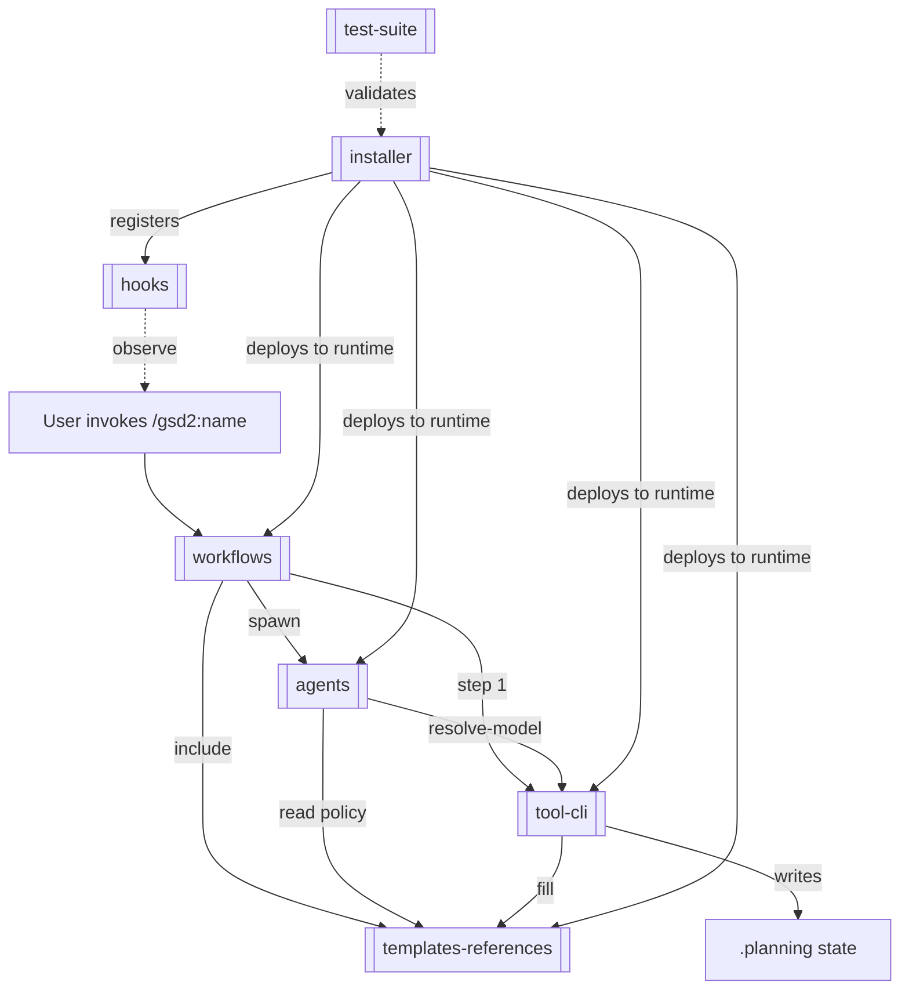

# System Map: get-shit-done

GSD is a workflow framework for AI coding assistants. It installs agent personas, slash-commands, workflow orchestration, document templates, behavioral references, and lifecycle hooks into Claude Code, Codex, Cursor, Copilot, Antigravity, Gemini CLI, and Opencode — then coordinates phase-based software-delivery work through those assets.

## Changelog

- 2026-04-17T00:00:00Z | full | regenerated 7 subsystems (installer, tool-cli, agents, workflows, templates-references, hooks, test-suite)

## Overview

## Subsystems

- [[installer]] — `bin/install.js` cross-runtime npm installer. Deploys GSD assets into Claude, Codex, Cursor, Copilot, Antigravity, Gemini CLI, and Opencode with per-runtime transforms (Codex sandbox levels, Copilot tool renaming, Cursor MCP conversion).

- [[tool-cli]] — `get-shit-done/bin/gsd-tools.cjs` + 15 lib modules. Single CLI entrypoint invoked by every workflow. Centralizes config, model resolution, phase lookup, state mutation, git commits, template fill, summary verification, and workflow bootstrap.

- [[agents]] — 20 persona files in `agents/gsd-*.md`. Each declares tools + behavior via YAML frontmatter. Workflows spawn agents via `Task(subagent_type=...)`; `model-profiles.cjs` maps agent → `{quality, balanced, budget}` → model.

- [[workflows]] — 49 workflow orchestration files in `get-shit-done/workflows/` invoked by 51 slash-command stubs in `commands/gsd2/`. Each workflow bootstraps via `gsd-tools.cjs init <name>`, executes numbered steps that spawn agents and invoke the CLI, and produces phase/milestone artifacts.

- [[templates-references]] — `get-shit-done/templates/*.md` (31 files, document scaffolds filled once per artifact) and `get-shit-done/references/*.md` (15 files, read-only policy loaded via `@`-includes by workflows and agents).

- [[hooks]] — four Claude Code lifecycle hooks in `hooks/`. `gsd-statusline.js` writes a context statusline, `gsd-context-monitor.js` injects low-context advisories, `gsd-workflow-guard.js` advises out-of-workflow edits, `gsd-check-update.js` checks for new GSD versions in a detached background child.

- [[test-suite]] — `tests/*.test.cjs` runs via `scripts/run-tests.cjs`. Primarily validates installer behavior across Claude, Codex, Copilot, Cursor, and Antigravity runtimes.

## Gaps

See [[system/_gaps|_gaps]] for behaviors that could not be sourced and should be investigated.
