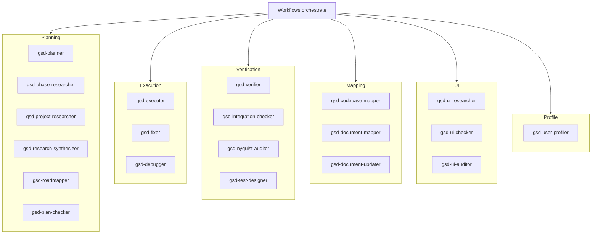

# Subsystem: Agents

**Updated:** 2026-04-17 by /gsd2:document (full run)
**Sources:** `agents/gsd-*.md`, `get-shit-done/bin/lib/model-profiles.cjs`, `get-shit-done/references/model-profiles.md`, `.planning/codebase/ARCHITECTURE.md`, `.planning/codebase/STRUCTURE.md:14-26`

## Shape

## How It Works

### Overview

20 agent personas live in `agents/gsd-*.md`. Each is a Markdown file with YAML frontmatter declaring `name`, `description`, `tools`, and `color`, followed by behavioral instructions (source: `.planning/codebase/STRUCTURE.md:172-173`). Workflows spawn agents via `Task(subagent_type="gsd-<role>", model="{resolved_model}", prompt="...")` (source: `.planning/codebase/STRUCTURE.md:175`). Orchestrators resolve the model by calling `node gsd-tools.cjs resolve-model <agent-type>` (see [[tool-cli]]).

### Agent Catalog

| Agent | Role |
|---|---|
| `gsd-planner` | Creates phase PLAN.md with task breakdown and dependency graph |
| `gsd-phase-researcher` | Produces RESEARCH.md for a phase before planning |
| `gsd-project-researcher` | Researches ecosystem before roadmap creation |
| `gsd-research-synthesizer` | Merges parallel research into SUMMARY.md |
| `gsd-roadmapper` | Creates project roadmaps with phase breakdown |
| `gsd-plan-checker` | Verifies plan will achieve phase goal before execution |
| `gsd-executor` | Executes plans with atomic commits and checkpoints |
| `gsd-fixer` | Fixes post-execution issues with dependency awareness |
| `gsd-debugger` | Scientific-method debugging with persistent state |
| `gsd-verifier` | Goal-backward verification of phase completion |
| `gsd-integration-checker` | Cross-phase integration + E2E flow validation |
| `gsd-nyquist-auditor` | Fills Nyquist validation gaps — generates tests |
| `gsd-test-designer` | Designs test plans for implemented code |
| `gsd-codebase-mapper` | Writes `.planning/codebase/*.md` analysis documents |
| `gsd-document-mapper` | Writes `docs/system/<subsystem>.md` (full doc runs) |
| `gsd-document-updater` | Two-pass incremental doc updates (propose → apply) |
| `gsd-ui-researcher` | Produces UI-SPEC.md design contract |
| `gsd-ui-checker` | Validates UI-SPEC.md against 6 quality dimensions |
| `gsd-ui-auditor` | Retroactive 6-pillar visual audit |
| `gsd-user-profiler` | Analyzes session messages across 8 behavioral dimensions |

(source: `agents/` directory listing)

### Model Profiles

`get-shit-done/bin/lib/model-profiles.cjs:9-30` defines the `MODEL_PROFILES` map — agent → `{quality, balanced, budget}` → model. Excerpt:

| Agent | quality | balanced | budget |
|---|---|---|---|
| gsd-planner | opus | opus | sonnet |
| gsd-executor | opus | sonnet | sonnet |
| gsd-phase-researcher | opus | sonnet | haiku |
| gsd-verifier | sonnet | sonnet | haiku |
| gsd-plan-checker | sonnet | sonnet | haiku |
| gsd-codebase-mapper | sonnet | haiku | haiku |
| gsd-document-mapper | sonnet | sonnet | haiku |
| gsd-document-updater | sonnet | sonnet | haiku |
| gsd-ui-researcher | opus | sonnet | haiku |

Valid profile names are derived from the keys of any single entry (source: `get-shit-done/bin/lib/model-profiles.cjs:31`). `formatAgentToModelMapAsTable` renders the map as a Unicode-bordered table (source: `get-shit-done/bin/lib/model-profiles.cjs:39-52`). `getAgentToModelMapForProfile(normalizedProfile)` returns the flat agent-to-model map for a given profile (source: `get-shit-done/bin/lib/model-profiles.cjs:60`).

The profile is configurable via `/gsd2:set-profile` (see [[workflows]]) and stored in `.planning/config.json`. Default profile selection logic is documented in `get-shit-done/references/model-profile-resolution.md`.

A single source-of-truth TODO is noted: `get-shit-done/references/model-profiles.md` is kept in sync manually; the docblock at `model-profiles.cjs:1-8` flags this as a future consolidation target.

### Codex Sandbox Mapping

For Codex installs, agents are bucketed by filesystem access in `bin/install.js:23-35` (`CODEX_AGENT_SANDBOX`): writing agents → `workspace-write`, checker agents → `read-only`. See [[installer]].

### Where to Add an Agent

1. Create `agents/gsd-<role>.md` with YAML frontmatter (`name`, `description`, `tools`, `color`) and behavior.
2. Add to `CODEX_AGENT_SANDBOX` in `bin/install.js` with an appropriate sandbox level.
3. Add to `MODEL_PROFILES` in `model-profiles.cjs` with quality/balanced/budget assignments.
4. Update install logic in `bin/install.js` to copy the new agent file.

(source: `.planning/codebase/STRUCTURE.md:172-173`)

## Interfaces

### Inputs

- Spawned by workflows via `Task(subagent_type=..., model=..., prompt=...)` with free-form prompt text
- Agent frontmatter `tools` field whitelists which tools the subagent can call

### Outputs

- Written artifacts (PLAN.md, SUMMARY.md, VERIFICATION.md, RESEARCH.md, UI-SPEC.md, `docs/system/*.md`, etc.)
- Confirmation strings returned to the orchestrator
- Mutations to `.planning/` state files via [[tool-cli]]

## Related

- [[tool-cli]] — `resolve-model` and `find-phase` commands; every agent's workflow invokes the CLI
- [[workflows]] — workflows are the orchestrators that spawn agents
- [[installer]] — maps agents to Codex sandbox levels and Copilot tools
- [[templates-references]] — agents read references (AGENTIC-PATTERNS, questioning, verification-patterns) as behavioral policy

## Gaps

See [[_gaps#agents]] for un-sourced behaviors.
