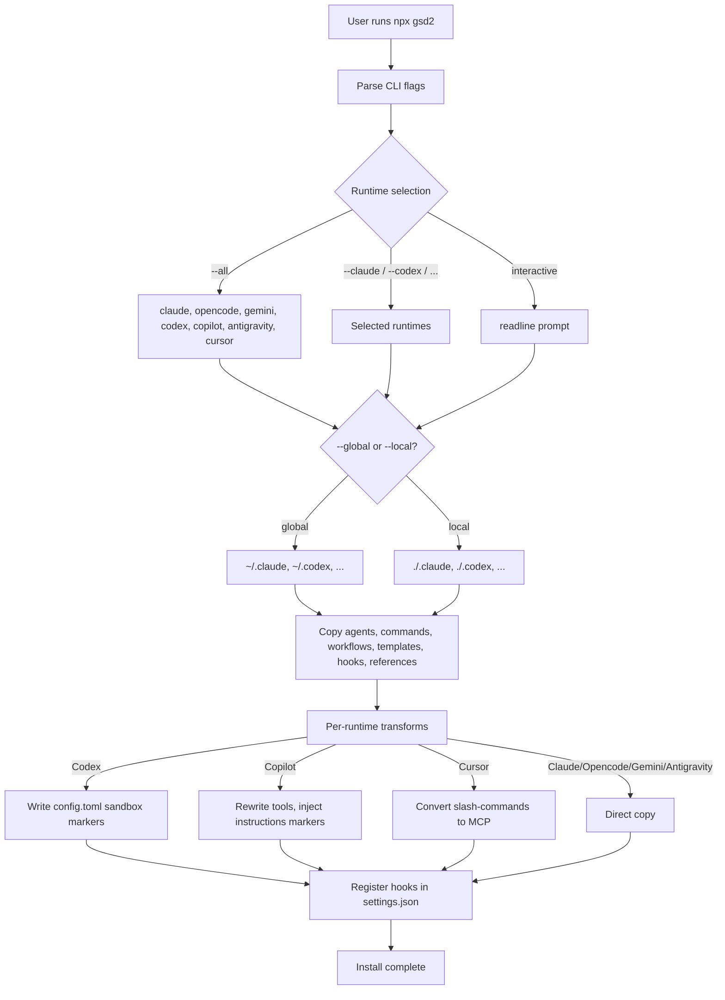

# Subsystem: Installer

**Updated:** 2026-04-17 by /gsd2:document (full run)
**Sources:** `bin/install.js`, `package.json`, `.planning/codebase/ARCHITECTURE.md:20-40`, `.planning/codebase/STRUCTURE.md:7-104`

## Shape

## How It Works

### Overview

`bin/install.js` is a single-file Node CLI invoked as `npx gsd2` (or `npx github:itsoneword/get-shit-done`). It deploys GSD runtime assets — agent personas, slash-commands, workflow instructions, templates, reference documents, and lifecycle hooks — into the target AI coding assistant's configuration directory (source: `bin/install.js:1-70`, `package.json` `bin` field).

### CLI Surface

Flags parsed from `process.argv.slice(2)` (source: `bin/install.js:57-86`):

- Runtime selectors: `--claude`, `--opencode`, `--gemini`, `--codex`, `--copilot`, `--antigravity`, `--cursor`
- Aggregate: `--all` (all seven), `--both` (legacy: claude + opencode)
- Scope: `--global` / `-g` (installs to `~/.{runtime}/`) vs `--local` / `-l` (installs to `./.{runtime}/`)
- Mode: `--uninstall` / `-u` removes the installation

Interactive fallback uses Node `readline` when no runtime flags are given (source: `bin/install.js:6`).

### Runtime-Specific Transforms

**Codex** requires a sandbox level per agent. `CODEX_AGENT_SANDBOX` (source: `bin/install.js:23-35`) maps writing agents (executor, planner, researchers, verifier, codebase-mapper, roadmapper, debugger) to `workspace-write` and checkers (plan-checker, integration-checker) to `read-only`. Installation writes a marked section to `config.toml` delimited by `# GSD Agent Configuration — managed by get-shit-done installer` (source: `bin/install.js:17`).

**Copilot** requires tool renaming: the `claudeToCopilotTools` map (source: `bin/install.js:39-52`) converts `Read→read`, `Write/Edit→edit`, `Bash→execute`, `Grep/Glob→search`, `Task→agent`, `WebSearch/WebFetch→web`, `TodoWrite→todo`, `AskUserQuestion→ask_user`, `SlashCommand→skill`. Tool mapping applies only to agents, not skills (source: `bin/install.js:38`). Instructions are injected between HTML markers `<!-- GSD Configuration — managed by get-shit-done installer -->` and `<!-- /GSD Configuration -->` (source: `bin/install.js:20-21`).

**Cursor** converts slash-commands into the MCP protocol; behavior validated by `tests/cursor-conversion.test.cjs`.

**Antigravity** installs files directly (no transform); behavior validated by `tests/antigravity-install.test.cjs`.

### WSL + Windows Detection

When `process.platform === 'win32'`, the installer checks `WSL_DISTRO_NAME` env var and `/proc/version` for `microsoft`/`wsl` strings to detect WSL-on-Windows-Node situations where backslash paths fail to resolve on the Linux filesystem (source: `bin/install.js:91-101`).

### Version Placeholder Substitution

`package.json` version is injected into hooks containing `{{GSD_VERSION}}`. This substitution is performed during the `build-hooks.js` step before install, not inside `install.js` itself (see [[hooks]] for build details).

## Interfaces

### Inputs

- CLI flags (see CLI Surface above)
- Stdin (interactive readline mode only)
- Environment: `CLAUDE_CONFIG_DIR` env var overrides default `~/.claude/` location (cross-checked with hook detection in `hooks/gsd-check-update.js:16-28`)

### Outputs

- Files written to runtime config dir (agents, commands, workflows, templates, references, hooks)
- `settings.json` or `config.toml` mutations within marked sections
- Exit code: 0 on success, non-zero on failure
- Stdout: ANSI-colored progress (colors defined at source: `bin/install.js:10-14`)

### Installed Layout

Per `.planning/codebase/STRUCTURE.md:127-133`:
- `~/.claude/get-shit-done/bin/gsd-tools.cjs` — [[tool-cli]] entry point
- `~/.claude/agents/gsd-*.md` — [[agents]] personas
- `~/.claude/commands/gsd2/*.md` — [[workflows]] slash-commands
- `~/.claude/get-shit-done/workflows/*.md` — [[workflows]] orchestration
- `~/.claude/get-shit-done/templates/*.md` — [[templates-references]] document scaffolding
- `~/.claude/get-shit-done/references/*.md` — [[templates-references]] behavioral policy

## Related

- [[hooks]] — installer registers hooks via `settings.json` hook configs and copies `hooks/dist/` artifacts
- [[agents]] — installer maps agent personas to Codex sandboxes and Copilot tool names
- [[workflows]] — installer copies slash-command stubs and workflow orchestration files
- [[test-suite]] — installer behavior is validated per-runtime in `tests/*.test.cjs`

## Gaps

See [[_gaps#installer]] for un-sourced behaviors.
