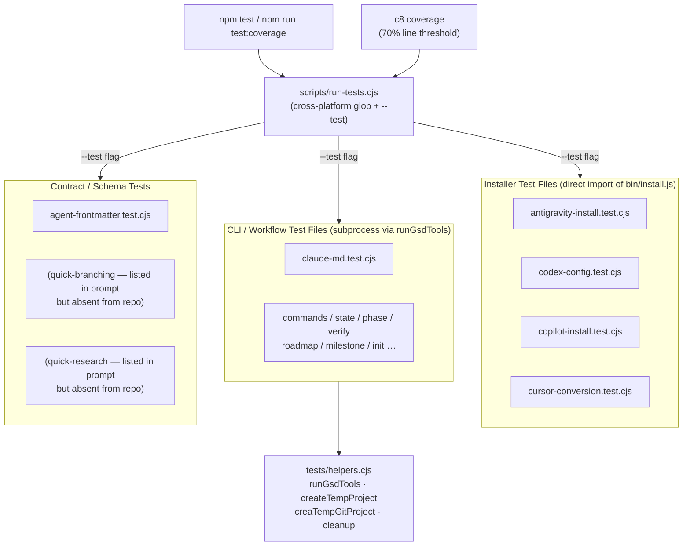

# Subsystem: Test Suite

**Updated:** 2026-04-17 by /gsd2:document (full run)
**Sources:** `.planning/codebase/TESTING.md`, `.planning/codebase/STRUCTURE.md`, `scripts/run-tests.cjs`, `tests/helpers.cjs`, `tests/antigravity-install.test.cjs`, `tests/codex-config.test.cjs`, `tests/copilot-install.test.cjs`, `tests/cursor-conversion.test.cjs`, `tests/claude-md.test.cjs`

## Shape

## How It Works

### Runner

`scripts/run-tests.cjs` is a thin cross-platform shim (source: `scripts/run-tests.cjs:1-29`). It reads `tests/` with `readdirSync`, filters for `*.test.cjs`, sorts the list, and passes the full paths to `node --test`. Exit code propagates from the child process so CI failures surface correctly. No shell glob expansion is used, which avoids failures on Windows PowerShell (source: `scripts/run-tests.cjs:3-4`).

Coverage is measured by wrapping the runner with `c8` and enforcing a 70% line threshold on `get-shit-done/bin/lib/*.cjs` (source: `.planning/codebase/TESTING.md:14`). The coverage command is invoked only via `npm run test:coverage`; plain `npm test` skips the threshold check (source: `.planning/codebase/TESTING.md:10-12`).

### Node.js Test Framework

All test files use Node.js built-in `node:test` (`describe`, `test`, `beforeEach`, `afterEach`) and `node:assert` (source: `.planning/codebase/TESTING.md:5-6`). There are no external assertion or mocking frameworks. Node 20+ is required by `package.json` engines (source: `.planning/codebase/STRUCTURE.md:98`).

### Shared Helpers (`tests/helpers.cjs`)

Three helpers are exported and used by almost every test file (source: `tests/helpers.cjs:1-76`):

| Helper | Purpose |
|---|---|
| `runGsdTools(args, cwd)` | Runs `gsd-tools.cjs` as a real subprocess. Accepts a string (shell-interpreted) or an array (safe for special characters via `execFileSync`). Returns `{success, output, error}`. |
| `createTempProject()` | Creates `mkdtemp` directory with `.planning/phases/` pre-built. Use when tests do not need git history. |
| `createTempGitProject()` | Same as above plus `git init`, test identity config, an initial commit. Use when the code calls `execGit`. |
| `cleanup(tmpDir)` | `fs.rmSync` the temp directory. Must be called in every `afterEach`. |

### Two Testing Modes

**Mode 1 — CLI subprocess (dominant).** Tests call `runGsdTools(...)`, parse the JSON stdout, and assert on the structured result (source: `.planning/codebase/TESTING.md:64-72`). Used for all `cmd*` functions that call `output()` or `process.exit()`.

**Mode 2 — Direct function import (unit).** Tests `require` library modules and call pure functions directly. Used for `core.cjs`, `frontmatter.cjs`, and `model-profiles.cjs` (source: `.planning/codebase/TESTING.md:74-91`). The installer tests below also use this mode against `bin/install.js`.

### Installer Test Files

All four installer test files set `process.env.GSD_TEST_MODE = '1'` at the top before importing `../bin/install.js`. This env var prevents the module's main CLI entry point from executing during test import (source: `tests/antigravity-install.test.cjs:8`, `tests/codex-config.test.cjs:9`, `tests/copilot-install.test.cjs:11`, `tests/cursor-conversion.test.cjs:9`).

**`antigravity-install.test.cjs`** — Tests Antigravity runtime path resolution (`getDirName` → `.agent`, `getGlobalDir` → `~/.gemini/antigravity` or `ANTIGRAVITY_CONFIG_DIR` env override), content conversion (`convertClaudeToAntigravityContent`: path replacements and `/gsd2:cmd` → `/gsd2-cmd`), agent conversion (Claude tool names → Gemini tool names, `Task` excluded), skill directory lifecycle (stale `gsd2-*` dirs removed, non-GSD dirs preserved), and manifest JSON generation (source: `tests/antigravity-install.test.cjs:29-423`).

**`codex-config.test.cjs`** — Tests the OpenAI Codex adapter. Covers `getCodexSkillAdapterHeader` (three-section skill adapter with `{{GSD_ARGS}}` variable), `convertClaudeAgentToCodexAgent` (frontmatter stripped to name+description, `<codex_agent_role>` block inserted), `generateCodexAgentToml` (per-agent `.toml` with `sandbox_mode` from `CODEX_AGENT_SANDBOX` map), and `mergeCodexConfig` (three merge cases: create, replace, append; idempotency; no duplicate markers; stale `[agents.gsd-*]` sections cleaned up). Also tests a safety invariant: non-boolean keys under `[features]` are detected and must not corrupt the TOML (source: `tests/codex-config.test.cjs:542-574`).

**`copilot-install.test.cjs`** — The largest installer test file. Covers path conversion (`convertClaudeToCopilotContent`: local → `.github/`, global → `~/.copilot/`), tool name mapping (`convertCopilotToolName`: 12 direct mappings + `mcp__context7__` prefix handling), command/agent conversion, source-code integration checks (string assertions against `bin/install.js` to verify `--copilot` flag parsing, runtime list inclusion, hook-skip logic), and two full E2E suites that actually execute `node bin/install.js --copilot --local` in a temp directory then assert on the installed file tree (source: `tests/copilot-install.test.cjs:1147-1366`). Expected counts: 49 skill directories, 17 agent `.agent.md` files.

**`cursor-conversion.test.cjs`** — Regression guard ensuring Cursor frontmatter `name:` fields are emitted as plain YAML scalars, not quoted strings. If Cursor sees `name: "gsd2-fix"` it treats the surrounding quotes as literal parts of the skill name (source: `tests/cursor-conversion.test.cjs:1-8`). Two tests: skill name unquoted, slash-command prefix preserved after `/gsd2:cmd` → `/gsd2-cmd` conversion.

**`claude-md.test.cjs`** — Tests `generate-claude-md` CLI command via subprocess and validates that `new-project.md` workflow contains required artifact references. Uses `createTempProject` fixture (source: `tests/claude-md.test.cjs:1-82`).

### Notable Patterns

**Regression documentation.** Known bugs are tracked with `REG-NN` identifiers and tests assert on the current (broken) behavior rather than suppressing the test (source: `.planning/codebase/TESTING.md:253-263`).

**Graceful error as success.** Commands that handle missing files gracefully exit 0 and return `{error: "..."}` in JSON. Tests must check `result.success` AND `output.error` separately (source: `.planning/codebase/TESTING.md:265-277`).

**Idempotency.** `mergeCodexConfig` is asserted to produce identical output on consecutive calls (source: `tests/codex-config.test.cjs:400-409`, `477-491`).

**No mocking.** All I/O is real: `fs` writes to `mkdtemp` directories, git commands run in real repos, CLI tests spawn real child processes (source: `.planning/codebase/TESTING.md:110-117`).

## Interfaces

### Inputs

| Interface | Detail | Source |
|---|---|---|
| `npm test` | Runs `node scripts/run-tests.cjs` | `package.json` scripts |
| `npm run test:coverage` | Wraps runner with `c8 --check-coverage --lines 70` | `.planning/codebase/TESTING.md:14` |
| `process.env.GSD_TEST_MODE = '1'` | Prevents `bin/install.js` CLI execution during import | `tests/antigravity-install.test.cjs:8` |

### Outputs

| Output | Detail | Source |
|---|---|---|
| TAP-like stdout | `node:test` native reporter output to stdout | `scripts/run-tests.cjs:23` |
| Exit code | 0 = all pass, 1 = any failure | `scripts/run-tests.cjs:27` |
| Coverage text report | `c8 --reporter text` to stdout (coverage runs only) | `.planning/codebase/TESTING.md:14` |

### Contracts Enforced

- All `gsd2-*` skill directories and `gsd-*.agent.md` files installed by Copilot runtime total exactly 49 and 17 respectively (source: `tests/copilot-install.test.cjs:EXPECTED_SKILLS`, `EXPECTED_AGENTS`).
- `CODEX_AGENT_SANDBOX` maps exactly 11 agents (source: `tests/codex-config.test.cjs:185-188`).
- Cursor frontmatter name fields must be unquoted YAML scalars (source: `tests/cursor-conversion.test.cjs:35-36`).
- Antigravity `Task` tool is excluded from agent conversions (source: `tests/antigravity-install.test.cjs:273-279`).
- `mergeCodexConfig` is idempotent — identical output on repeated calls (source: `tests/codex-config.test.cjs:400-409`).

## Related

- [[install-service]] — `bin/install.js` is the primary module under test in all four installer test files
- [[gsd-tools-cli]] — `get-shit-done/bin/gsd-tools.cjs` is the subprocess target for CLI integration tests via `runGsdTools`

## Gaps

See [[_gaps#test-suite]] for un-sourced behaviors.
