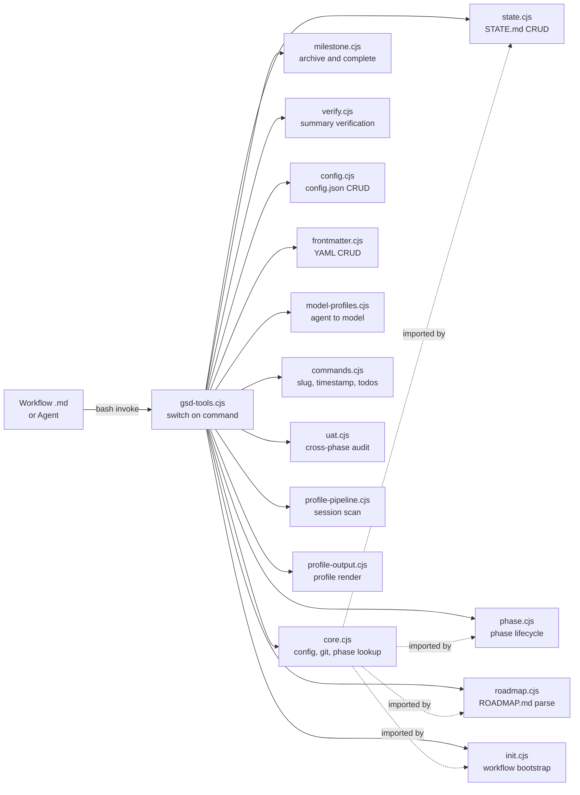

# Subsystem: Tool CLI

**Updated:** 2026-04-17 by /gsd2:document (full run)
**Sources:** `get-shit-done/bin/gsd-tools.cjs`, `get-shit-done/bin/lib/*.cjs`, `.planning/codebase/ARCHITECTURE.md`, `.planning/codebase/STRUCTURE.md:41-53`, `.planning/codebase/CONVENTIONS.md`

## Shape

## How It Works

### Overview

`get-shit-done/bin/gsd-tools.cjs` is the single CLI entrypoint invoked by every GSD workflow and agent. It centralizes config parsing, model resolution, phase lookup, git commits, summary verification, and ~50 other operations that would otherwise be duplicated as inline bash across workflow files (source: `get-shit-done/bin/gsd-tools.cjs:3-9`).

### Routing

`gsd-tools.cjs` reads `process.argv`, switches on the first arg, dispatches to the appropriate lib module's `cmd*` function, and formats the result (source: `get-shit-done/bin/gsd-tools.cjs`). Every lib module exports `cmd*` functions that accept raw args and return structured output; the router handles `--raw` flag for machine-readable output vs human-friendly rendering.

### Output Convention

All command functions follow the `output(result, raw, rawValue)` pattern for responses and `error(message)` for failures (source: `.planning/codebase/STRUCTURE.md:170`).

### Lib Modules

**core.cjs** — shared foundation: `loadConfig(cwd)`, `findPhaseInternal(phase)`, `normalizeMd`, git helpers. Every other lib imports from here (source: `.planning/codebase/STRUCTURE.md:43, 118`).

**state.cjs** — STATE.md read/write and progression. STATE.md is read first in every workflow; this module owns all STATE.md operations (source: `.planning/codebase/STRUCTURE.md:44, 120-121`).

**phase.cjs** — phase CRUD: `phase next-decimal`, `phase add`, `phase insert`, `phase remove`, `phase complete` (source: `get-shit-done/bin/gsd-tools.cjs:38-42`).

**roadmap.cjs** — ROADMAP.md parse and update: `roadmap get-phase`, `roadmap analyze`, `roadmap update-plan-progress` (source: `get-shit-done/bin/gsd-tools.cjs:44-46`).

**milestone.cjs** — milestone completion and archival: `milestone complete <version> [--archive-phases]` (source: `get-shit-done/bin/gsd-tools.cjs:53-56`).

**init.cjs** — compound init commands that bundle all workflow context into a single JSON response. Primary way orchestrators load state (source: `.planning/codebase/STRUCTURE.md:119`). Each workflow starts with `node gsd-tools.cjs init <workflow>` as the first step (source: `.planning/codebase/STRUCTURE.md:179`).

**verify.cjs** — `verify-summary <path>` validates a SUMMARY.md against the expected schema (source: `get-shit-done/bin/gsd-tools.cjs:23`).

**config.cjs** — `.planning/config.json` CRUD, including `config-ensure-section` (source: `get-shit-done/bin/gsd-tools.cjs:28`).

**frontmatter.cjs** — YAML frontmatter parse/serialize/CRUD: `frontmatter get`, `frontmatter set` (source: `get-shit-done/bin/gsd-tools.cjs:77-79`).

**model-profiles.cjs** — agent-to-model mapping. See [[agents]] for the full profile table.

**commands.cjs** — utility commands: `generate-slug`, `current-timestamp`, `list-todos`, `progress`, `verify-path-exists`, `websearch` (source: `get-shit-done/bin/gsd-tools.cjs:24-33`).

**uat.cjs** — cross-phase UAT/VERIFICATION.md scanner, exposed as `audit-uat` (source: `get-shit-done/bin/gsd-tools.cjs:68`).

**profile-pipeline.cjs** + **profile-output.cjs** — session transcript scanning and structured user-profile rendering. Used by [[agents]]'s `gsd-user-profiler`.

### Atomic Commands (non-exhaustive)

Per `gsd-tools.cjs:11-79` header docblock: `state load`, `state json`, `state update`, `state patch`, `state begin-phase`, `state signal-waiting`, `resolve-model <agent>`, `find-phase <n>`, `commit <msg>`, `verify-summary <path>`, `history-digest`, `summary-extract`, `phase-plan-index`, `websearch`, `milestone complete`, `validate consistency`, `validate health`, `progress [json|table|bar]`, `todo complete`, `audit-uat`, `scaffold context|uat|verification|phase-dir`, `frontmatter get|set`.

### Naming Conventions

- Top-level command functions: camelCase prefixed with `cmd` (e.g., `cmdPhasesList`, `cmdStateLoad`, `cmdVerifySummary`)
- Internal utilities: camelCase without prefix (e.g., `loadConfig`, `findPhaseInternal`, `normalizeMd`)
- All lib files: `kebab-case.cjs` (source: `.planning/codebase/STRUCTURE.md:141, 149-151`)

## Interfaces

### Inputs

- CLI args: `node gsd-tools.cjs <command> [args] [--raw]`
- Reads `.planning/config.json` via `loadConfig(cwd)` (source: `.planning/codebase/STRUCTURE.md:126`)
- Reads `.planning/STATE.md` (every workflow loads it first)
- Reads `.planning/ROADMAP.md`, phase directories, SUMMARY.md files

### Outputs

- Stdout: JSON (with `--raw`) or human-formatted strings
- Stderr: error messages via `error(message)`
- Side-effects: writes to `.planning/STATE.md`, ROADMAP.md, phase dirs, git commits (via `commit <msg> [--files ...]`)
- Exit code: 0 on success, non-zero on failure

### Where to Add a Command

Add the command function to the appropriate lib module in `get-shit-done/bin/lib/`. Register in the `switch` block in `gsd-tools.cjs`. Export from the lib module's `module.exports`. Follow `output(result, raw, rawValue)` / `error(message)` conventions (source: `.planning/codebase/STRUCTURE.md:170`).

## Related

- [[workflows]] — every workflow `.md` starts with `init <workflow>` calling this CLI
- [[agents]] — agents call `resolve-model <agent-type>` to pick their model; [[templates-references]] read directly by agents/workflows
- [[installer]] — installs this CLI to `~/.claude/get-shit-done/bin/gsd-tools.cjs`

## Gaps

See [[_gaps#tool-cli]] for un-sourced behaviors.
